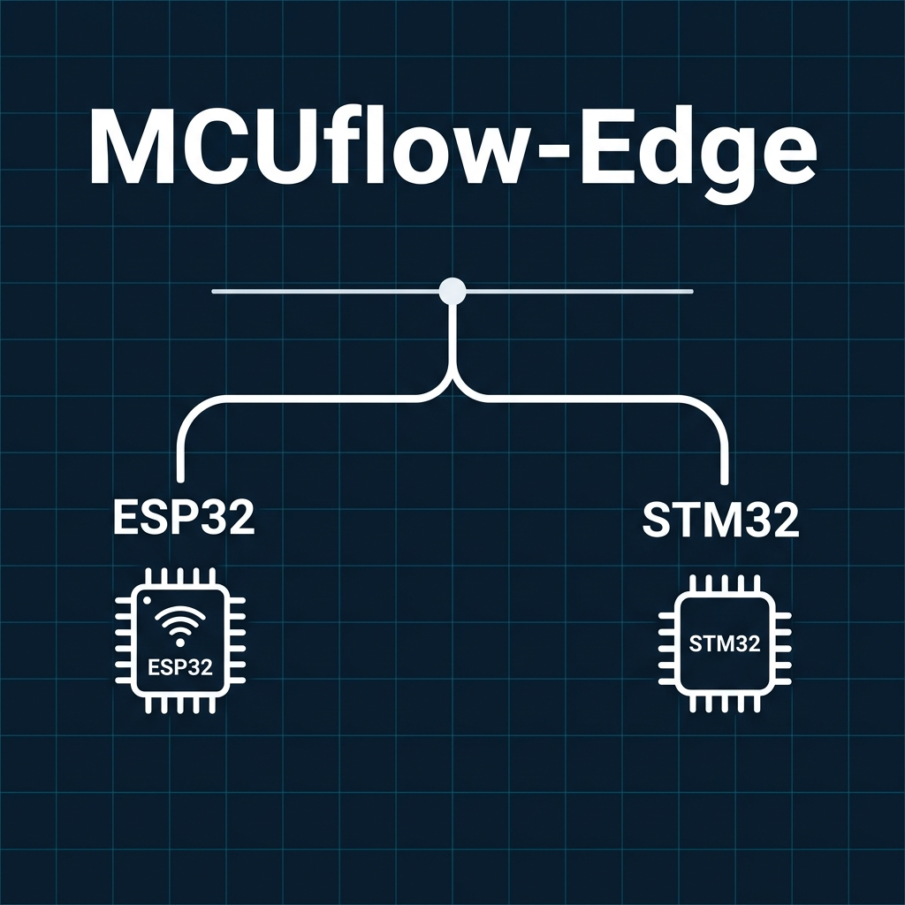

# MCUflow-Edge

[](https://www.python.org/downloads/)
[](LICENSE)
[](https://github.com/agodianel/mcuflow-edge/actions)

**One workflow for edge AI on ESP32 and STM32.**

<p align="center">
  
</p>

MCUflow-Edge helps embedded developers capture sensor data, build reproducible datasets, package tiny models, deploy them to real boards, and benchmark the result — all with one consistent CLI.

## Why?

Embedded AI workflows are fragmented. Developers typically use one tool to capture sensor data, another to clean it, another to convert a model, another to integrate into firmware, and yet another to benchmark the result. ESP32 and STM32 already have real inference routes (ESP-IDF + TFLM, STM32Cube.AI), but the surrounding workflow is still clumsy and inconsistent.

**MCUflow-Edge solves that missing layer.** Instead of replacing vendor runtimes, it wraps proven target-native paths into one practical, reproducible experience.

## Installation

### From source (recommended during alpha)

```bash
git clone https://github.com/agodianel/mcuflow-edge.git
cd mcuflow-edge
uv sync
uv run mcue --help
```

### Requirements

- Python 3.11+
- [uv](https://docs.astral.sh/uv/) (recommended) or pip

## V1 Workflow

```bash
# 1. Initialize a workspace
mcue init imu-gesture

# 2. Capture labeled IMU data from boards
mcue capture --target esp32 --port /dev/ttyUSB0 --label shake
mcue capture --target esp32 --port /dev/ttyUSB0 --label idle
mcue capture --target stm32 --port /dev/tty.usbmodemXXXX --label tap

# 3. Build a dataset from captured sessions
mcue dataset build ./sessions --out ./artifacts/dataset.npz

# 4. Package a trained model for each target
mcue pack --target esp32 --model ./models/gesture.tflite
mcue pack --target stm32 --model ./models/gesture.tflite

# 5. Deploy packaged artifacts into firmware templates
mcue deploy --target esp32 --port /dev/ttyUSB0
mcue deploy --target stm32 --project ./firmware/stm32-cube-template

# 6. Benchmark on real hardware
mcue bench --target esp32 --port /dev/ttyUSB0
mcue bench --target stm32 --port /dev/tty.usbmodemXXXX
```

## Supported Hardware (V1)

| Family | Board | Runtime Path |
|--------|-------|-------------|
| ESP32  | ESP32-S3 dev kit | ESP-IDF + [esp-tflite-micro](https://github.com/espressif/esp-tflite-micro) |
| STM32  | STWIN / STWIN.box or Nucleo + IMU | [STM32Cube.AI](https://www.st.com/en/embedded-software/x-cube-ai.html) |

## Project Structure

```
mcuflow-edge/
├── mcuflow_edge/           # Python CLI package
│   ├── cli/                # Click commands (init, capture, dataset, pack, deploy, bench)
│   ├── capture/            # Serial capture protocol and session format
│   ├── dataset/            # Dataset builder, validators, and CSV/NPZ export
│   ├── pack/               # Model packaging, inspection, and manifest generation
│   ├── deploy/             # Artifact copier and target-specific deployers
│   ├── bench/              # Benchmark output parser and report writer
│   ├── targets/            # Target adapters (esp32, stm32) with central registry
│   └── utils/              # Shared utilities (JSON I/O, logging)
├── firmware/               # Board firmware templates
│   ├── esp32-idf-template/ # ESP-IDF project with capture/inference/benchmark modes
│   └── stm32-cube-template/# STM32Cube project skeleton
├── examples/               # Example projects (imu-gesture)
├── tests/                  # Test suite (50 tests)
├── docs/                   # Documentation
└── scripts/                # Dev and demo scripts
```

## Documentation

- [Architecture](docs/architecture.md) — System layers and module responsibilities
- [Supported Boards](docs/supported-boards.md) — Hardware matrix and board details
- [Session Format](docs/session-format.md) — Capture session schema (JSONL + metadata)
- [Pack Format](docs/pack-format.md) — Model packaging manifest and folder structure
- [Benchmark Format](docs/benchmark-format.md) — Benchmark report schema

## Development

```bash
# Install dev dependencies
uv sync

# Run tests
uv run pytest tests/ -v

# Lint
uv run ruff check mcuflow_edge/ tests/
```

See [CONTRIBUTING.md](CONTRIBUTING.md) for guidelines.

## Project Status

**V1 Alpha** — Core workflow is implemented and tested. The CLI, session format, dataset builder, model packager, deployer, and benchmark reporter are functional. Firmware templates are scaffolded for ESP32 (with C source files) and STM32 (skeleton).

### What works now
- `mcue init` — workspace scaffolding
- `mcue capture` — serial IMU data capture with JSONL output
- `mcue dataset build` — NPZ/CSV dataset generation from sessions
- `mcue pack` — model packaging with manifest and inspection
- `mcue deploy` — artifact deployment into firmware templates
- `mcue bench` — benchmark parsing and JSON report generation

### Coming in V1.1
- Additional boards within ESP32 and STM32 families
- Better model inspection and report formatting
- Optional export plugins

## License

[MIT](LICENSE)
