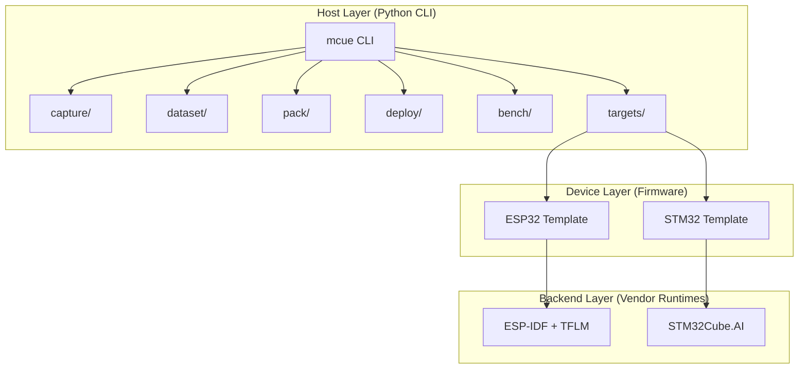

# Architecture

MCUflow-Edge has three layers that work together to provide a unified workflow from sensor capture to benchmark reporting.



## Layer Responsibilities

### Host Layer (Python)

The `mcue` CLI is the stable public interface. All user interaction happens here.

| Module | Responsibility |
|--------|---------------|
| `cli/` | Click command definitions and argument parsing |
| `capture/` | Serial protocol parsing, session I/O (JSONL + metadata) |
| `dataset/` | Session validation, windowed dataset building (NPZ/CSV) |
| `pack/` | Model inspection (.tflite), manifest generation, artifact packaging |
| `deploy/` | File copying into firmware templates, next-step instructions |
| `bench/` | Serial benchmark output parsing, JSON report generation |
| `targets/` | Target adapter registry and per-target implementations |
| `utils/` | Shared JSON I/O and logging |

### Device Layer (Firmware)

Target-specific firmware templates that run on real hardware:

- **ESP32**: ESP-IDF project with `app_main.c`, `imu_capture.c`, `inference_runner.c`, `benchmark.c`, and `capture_protocol.c`
- **STM32**: STM32Cube project skeleton with integration points for STM32Cube.AI

### Backend Layer (Vendor Runtimes)

MCUflow-Edge does not replace these runtimes — it wraps them:

- **ESP32**: Espressif's [esp-tflite-micro](https://github.com/espressif/esp-tflite-micro) component for TensorFlow Lite Micro inference
- **STM32**: ST's [STM32Cube.AI](https://www.st.com/en/embedded-software/x-cube-ai.html) for model optimization and code generation

## Data Flow


## Target Adapter Pattern

All target-specific logic is encapsulated in adapter classes that implement `TargetAdapter`:

```python
class TargetAdapter(ABC):
    name: str
    def validate_environment(self) -> None: ...
    def pack_model(self, model_path: Path, output_dir: Path) -> None: ...
    def deploy(self, package_dir: Path, **kwargs) -> None: ...
    def benchmark(self, **kwargs) -> dict: ...
```

The central registry in `mcuflow_edge/targets/__init__.py` provides `get_adapter(name)` for CLI commands, so no command needs to know about specific target implementations.
